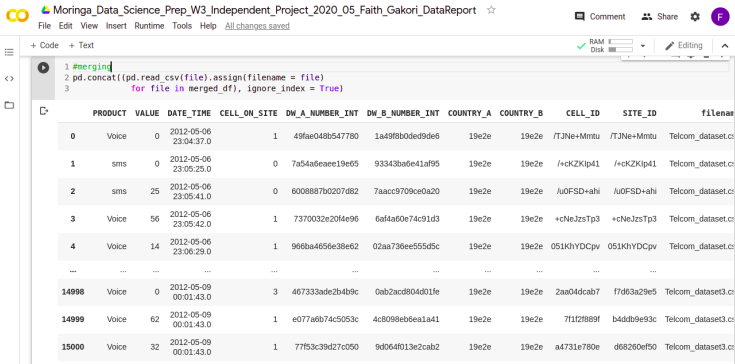

##  TITLE
 PANDAS COLAB

## AUTHOR
 Built By Faith Gakori

## PROJECT DESCRIPTION
 The project is used to analyse the perfomance of MTN company in Ivory Coast.As a data scientist, I am required to analyse the problem statement and come with vaious solution. All the analysis is done in a colab notebook by using python pandas.lastly, write a report using the CRISP-DM methodology.
    

## SCREENSHOTS

## SetUp / Installation Requirements
  Clone the repo by running:
*   git clone https://github.com/Gakori/awwards.git

 Navigate to the project directory;
*   cd pandas

 Open the Vs code:
*   code

## TECHNOLOGIES USED
* Python pandas

## CONTACT INFORMATION
 For email reach us through faithgakori506@gmail.com

## LICENCE
MIT License

Copyright (c) 2020 Faith Gakori

Permission is hereby granted, free of charge, to any person obtaining a copy of this software and associated documentation files (the "Software"), to deal in the Software without restriction, including without limitation the rights to use, copy, modify, merge, publish, distribute, sublicense, and/or sell copies of the Software, and to permit persons to whom the Software is furnished to do so, subject to the following conditions:

The above copyright notice and this permission notice shall be included in all copies or substantial portions of the Software.

THE SOFTWARE IS PROVIDED "AS IS", WITHOUT WARRANTY OF ANY KIND, EXPRESS OR IMPLIED, INCLUDING BUT NOT LIMITED TO THE WARRANTIES OF MERCHANTABILITY, FITNESS FOR A PARTICULAR PURPOSE AND NONINFRINGEMENT. IN NO EVENT SHALL THE AUTHORS OR COPYRIGHT HOLDERS BE LIABLE FOR ANY CLAIM, DAMAGES OR OTHER LIABILITY, WHETHER IN AN ACTION OF CONTRACT, TORT OR OTHERWISE, ARISING FROM, OUT OF OR IN CONNECTION WITH THE SOFTWARE OR THE USE OR OTHER DEALINGS IN THE SOFTWARE.